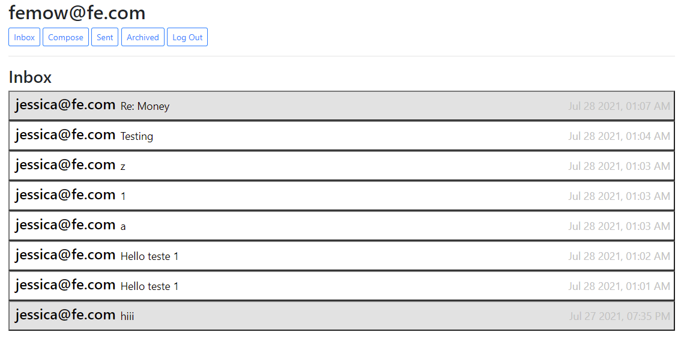

# CS50 Harvard - Project Mail

# Mail

Using JavaScript, HTML, and CSS, complete the implementation of your single-page-app email client inside of inbox.js (and not additional or other files; for grading purposes, we’re only going to be considering inbox.js!).

# Languages

## Front end

   

## Back end

 

# Specification

### Send Mail:

- [x]  Your application should have at least three models in addition to the User model: one for auction listings, one for bids, and one for comments made on auction listings. It’s up to you to decide what fields each model should have, and what the types of those fields should be. You may have additional models if you would like.

### Mailbox

- [x] When a user visits their Inbox, Sent mailbox, or Archive, load the appropriate mailbox.

      You’ll likely want to make a GET request to /emails/<mailbox> to request the emails for a particular mailbox.
      When a mailbox is visited, the application should first query the API for the latest emails in that mailbox.
      When a mailbox is visited, the name of the mailbox should appear at the top of the page (this part is done for you).
      Each email should then be rendered in its own box (e.g. as a 
 with a border) that displays who the email is from, what the subject line is, and the timestamp of the email.
      If the email is unread, it should appear with a white background. If the email has been read, it should appear with a gray background.

### View Email:

- [x]  When a user clicks on an email, the user should be taken to a view where they see the content of that email.

      You’ll likely want to make a GET request to /emails/<email_id> to request the email.
      Your application should show the email’s sender, recipients, subject, timestamp, and body.
      You’ll likely want to add an additional div to inbox.html (in addition to emails-view and compose-view) for displaying the email. Be sure to update your code to hide and show the right views when navigation options are clicked.
      See the hint in the Hints section about how to add an event listener to an HTML element that you’ve added to the DOM.
      Once the email has been clicked on, you should mark the email as read. Recall that you can send a PUT request to /emails/<email_id> to update whether an email is read or not.
      
### Archive and Unarchive

- [x] Allow users to archive and unarchive emails that they have received.

      When viewing an Inbox email, the user should be presented with a button that lets them archive the email. When viewing an Archive email, the user should be presented with a button that lets them unarchive the email. This requirement does not apply to emails in the Sent mailbox.
      Recall that you can send a PUT request to /emails/<email_id> to mark an email as archived or unarchived.
      Once an email has been archived or unarchived, load the user’s inbox.
      
### Reply

- [x] Allow users to reply to an email.

      When viewing an email, the user should be presented with a “Reply” button that lets them reply to the email.
      When the user clicks the “Reply” button, they should be taken to the email composition form.
      Pre-fill the composition form with the recipient field set to whoever sent the original email.
      Pre-fill the subject line. If the original email had a subject line of foo, the new subject line should be Re: foo. (If the subject line already begins with Re: , no need to add it again.)
      Pre-fill the body of the email with a line like "On Jan 1 2020, 12:00 AM foo@example.com wrote:" followed by the original text of the email.

[⬆ Voltar ao topo](#cs50-project-2) 
